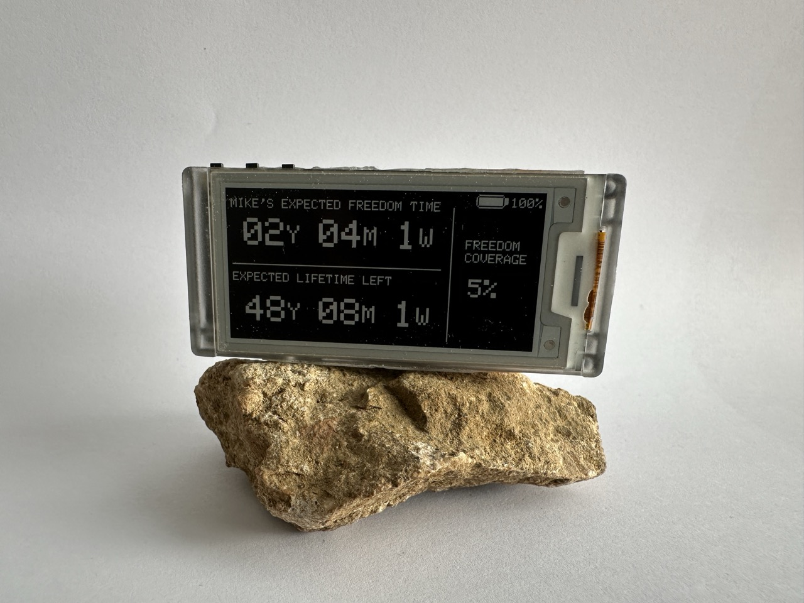
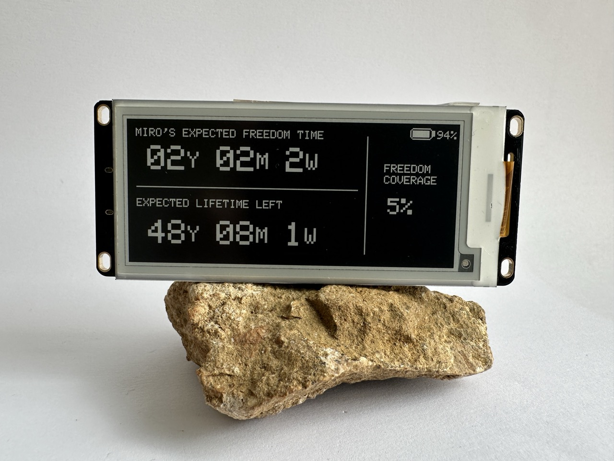
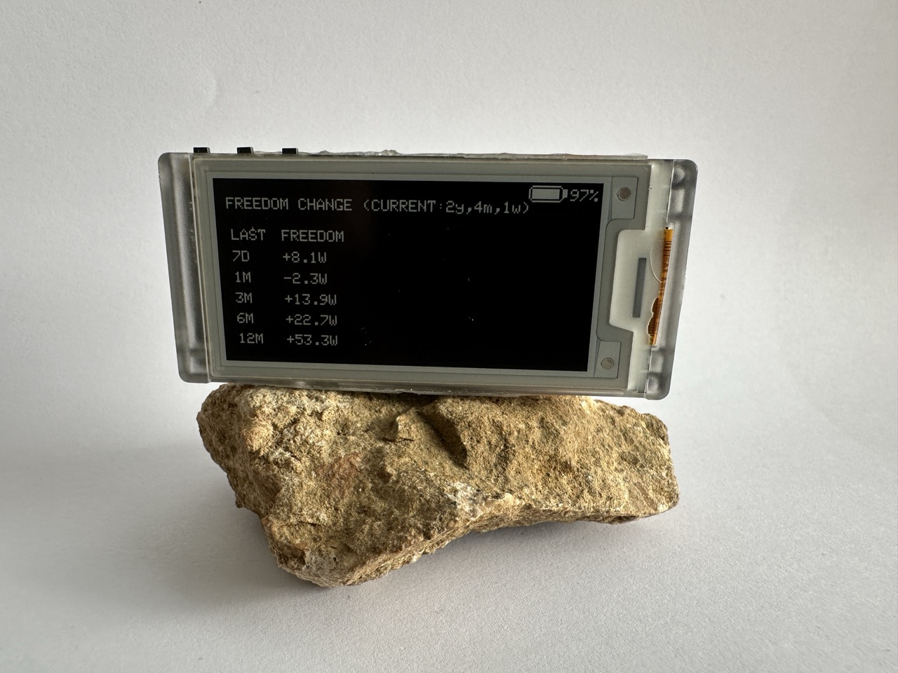
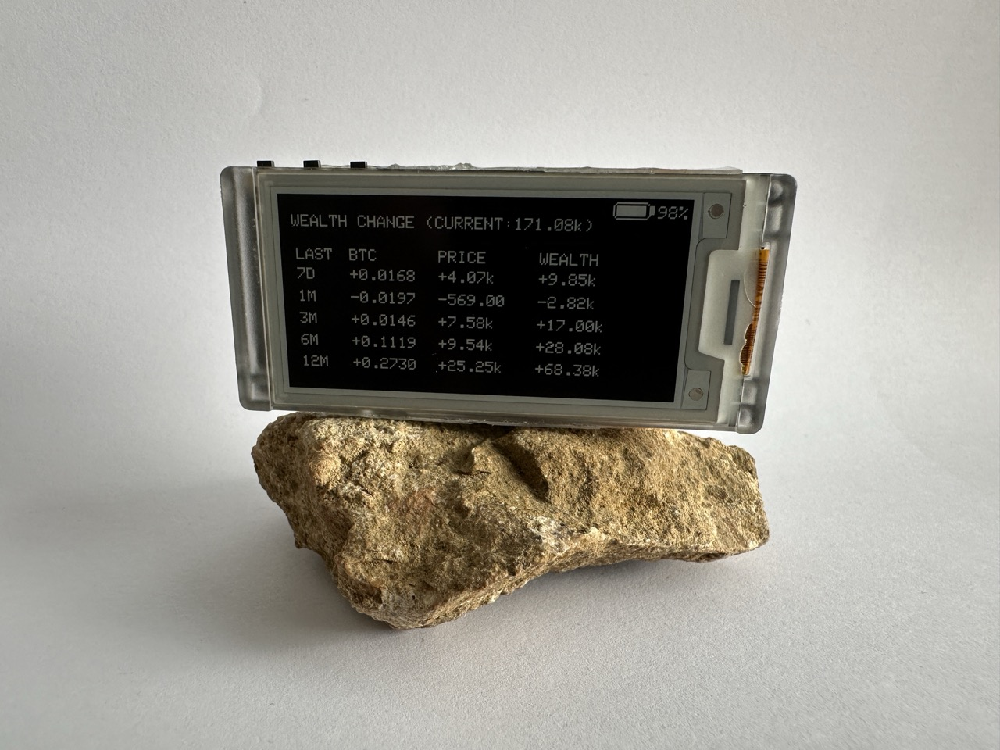
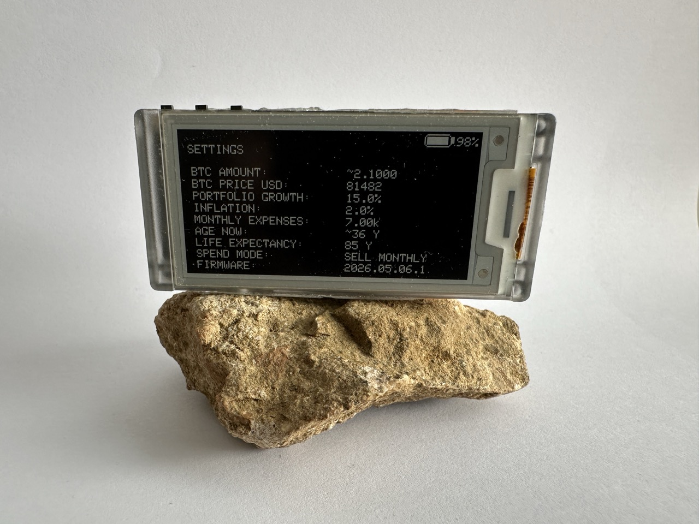

# Freedom Clock

Freedom Clock is a low-power e-ink device that turns savings into time. It is built for anyone who wants a calm, local-first view of freedom coverage instead of another price-anxiety dashboard.

The current firmware supports both Heltec Vision Master E-series boards:

- Heltec Vision Master E213
- Heltec Vision Master E290

Both boards use the same source code and release line. The firmware selects the right display driver and layout at compile time based on the board selected in Arduino IDE.

## Photos











## What It Shows

- Screen 1: expected freedom time, expected lifetime left, and freedom coverage.
- Screen 2: freedom change, opened with one `21 / GPIO21` button press.
- Screen 3: current wealth and wealth change, opened with two quick `21` presses.
- Screen 4: settings and input parameters, opened with three quick `21` presses.

## Portfolio Modes

- Static BTC + price online: enter a BTC amount manually; the device fetches BTC/USD from CoinGecko.
- Automatic BTC via MQTT: BTC amount and BTC/USD price come from local MQTT topics.
- Static net worth: enter total wealth in USD directly.

Spend mode can be either monthly selling or yearly borrowing. The display can use light mode or dark mode.

MQTT mode is best for bitcoiners who already run local infrastructure, for example a Bitcoin node, home server, or dashboard that watches read-only wallets and publishes values on the local network. In that setup, Freedom Clock only needs the MQTT broker address and topic names for BTC price and BTC amount. It does not need wallet keys, xpubs, exchange logins, or cloud accounts.

## Supported Hardware

- Heltec Vision Master E213, 2.13 inch e-ink display, `250 x 122`
- Heltec Vision Master E290, 2.90 inch e-ink display, `296 x 128`
- ESP32-S3
- optional, but recommended, 3.7V LiPo battery

Optional night reading/front-light notes live in [docs/FRONTLIGHT.md](docs/FRONTLIGHT.md).

## First Setup

On first boot, or after factory reset, the device creates a setup Wi-Fi network:

```text
Freedom_Clock_<DEVICE_ID>
```

Join it with the setup password shown on the e-ink screen and open:

```text
http://192.168.4.1
```

The setup Wi-Fi password is randomized each time setup mode starts. It is not derived from the public network name.

The setup page lets you configure owner, life expectancy, portfolio model, Wi-Fi, MQTT, display theme, refresh interval, optional setup PIN, and firmware updates.

To reopen setup later, hold the `21 / GPIO21` button while waking the device and release after about 5 seconds. To factory reset, keep holding for about 10 seconds.

## Defaults

Main fallback defaults are in [Freedom_Clock_HeltecVME.ino](Freedom_Clock_HeltecVME.ino).

- static BTC amount: `0.1 BTC`
- static net worth: `1000000 USD`
- monthly spend: `10000 USD`
- borrow fee: `8%`
- inflation: `2%`
- portfolio growth: `10%`
- owner: `OWNER`
- birth year: `1990`
- life expectancy: `85`
- refresh: `1 day`
- theme: `Dark`

## Privacy

Freedom Clock is local-first. Saved Wi-Fi, MQTT, owner, age model, BTC amount, and PIN data stay on the device. `secrets.h` is optional, gitignored, and should never be committed.

Important OPSEC note: if someone physically steals an unlocked/open device, the screen and flash storage may reveal private assumptions such as owner name, birth year, saved Wi-Fi/MQTT configuration, and portfolio values. For stronger at-rest protection, use the secure device setup guide.

Secure setup guide:

- [docs/SECURE_DEVICE_SETUP.md](docs/SECURE_DEVICE_SETUP.md)

## Battery

Battery percentage is an estimate based on measured LiPo voltage. The firmware uses the board battery ADC and a voltage-to-percent curve, but small differences between batteries, charging circuits, ADC calibration, and load can affect the displayed percentage.

The device keeps a small rolling battery calibration log locally. Open setup mode and use `Battery Calibration Log` to copy recent voltage and percentage samples. That data can be used to tune the percentage curve for the real board and battery.

Battery stats logging is enabled by default. Developers can disable it locally in `secrets.h`:

```cpp
#define LOG_BATTERY_STATS 0
```

## Firmware Updates

The setup page supports two update paths:

- online check and install from the latest GitHub Release when the device has working Wi-Fi with internet access
- manual `.bin` upload from a phone or laptop

Online release checks and downloads use HTTPS certificate validation. If the device cannot sync time with NTP, online updates fail closed instead of downloading firmware over an unverifiable TLS session.

GitHub releases live under:

```text
https://github.com/mr21free/freedom_clock_heltec_vme/releases
```

Release assets should be model-specific, for example:

```text
FreedomClock-<version>-E213-manual-update-open.bin
FreedomClock-<version>-E290-manual-update-open.bin
```

Saved settings and daily history stay on the device during a normal firmware update. Factory reset clears saved settings and history.

## Build And Flash

1. Install Arduino IDE.
2. Install Heltec ESP32 board support.
3. Open [Freedom_Clock_HeltecVME.ino](Freedom_Clock_HeltecVME.ino).
4. Select your board:
   - `Heltec Vision Master E213` for E213
   - `Heltec Vision Master E290` for E290
5. Flash the device.
6. Join the device setup Wi-Fi and configure it in the browser.

Important: each board needs firmware compiled for that exact board profile. Do not flash an E213 `.bin` onto an E290 or the other way around.

Optional private bootstrap defaults can be put in a local `secrets.h`:

```cpp
#define USE_SECRETS_BOOTSTRAP 1
```

Use [secrets.example.h](secrets.example.h) as the template.

## Developer Test History

To generate fake daily history for reviewing screens 3 and 4, temporarily add this to local `secrets.h`, flash once, then remove it again:

```cpp
#define ENABLE_TEST_HISTORY 1
#define FORCE_TEST_HISTORY_ON_EVERY_BOOT 1
```

`ENABLE_TEST_HISTORY` enables synthetic history seeding. `FORCE_TEST_HISTORY_ON_EVERY_BOOT` overwrites that history on every boot, so leave it on only while actively testing.

## Device Support

The project uses one shared firmware and one release line. Display differences between E213 and E290 are handled by compile-time device profiles and layout constants, not separate forks.

Details:

- [docs/DEVICE_SUPPORT.md](docs/DEVICE_SUPPORT.md)

## License

MIT
