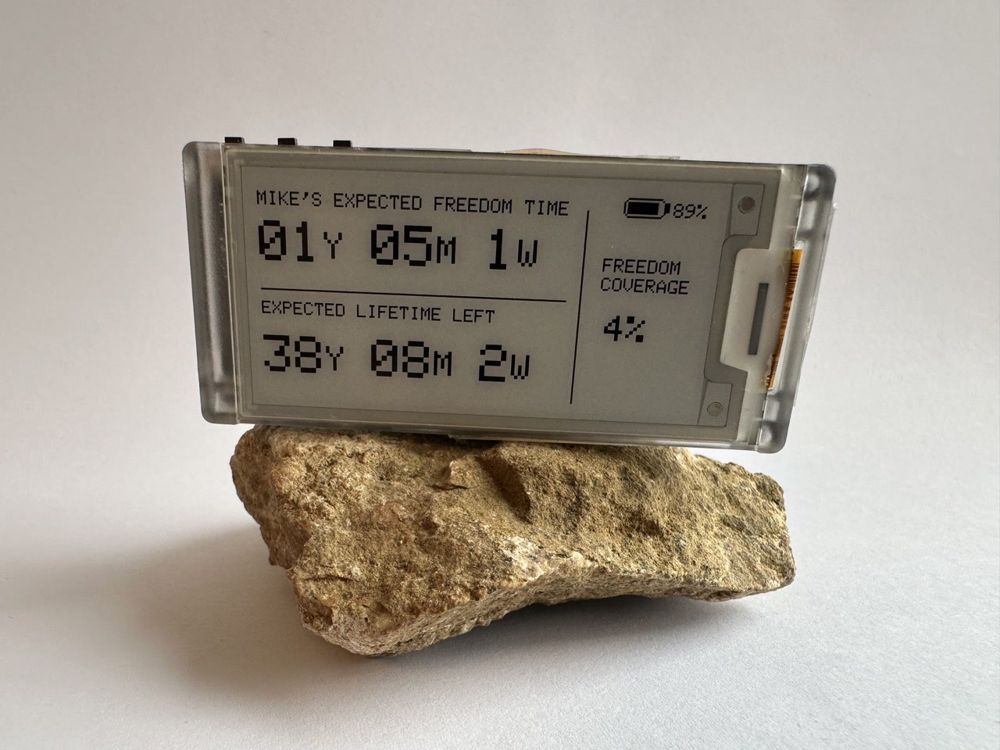
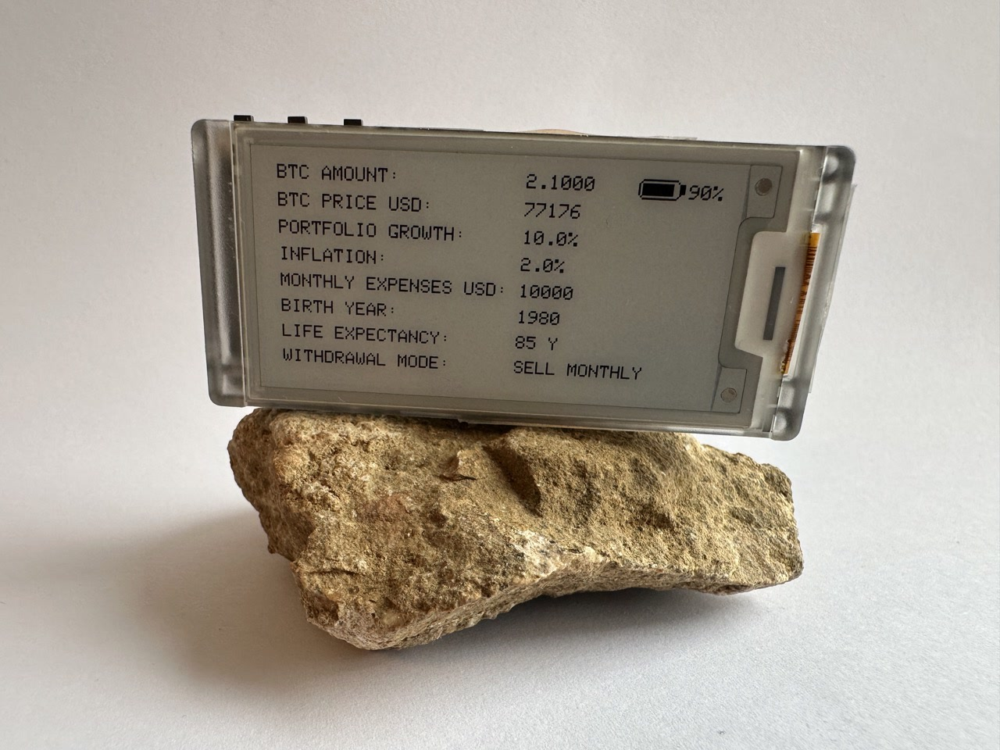

# Freedom Clock

Freedom Clock is a low-power e-ink device for the Heltec Vision Master E213 that turns savings into time.

It shows:
- expected freedom time
- expected lifetime left
- freedom coverage
- a second details screen with portfolio and life settings

The project supports both:
- `BTC` mode: wealth is derived from BTC amount and BTC/USD price
- `WEALTH` mode: wealth is entered directly in USD

It also supports two withdrawal models:
- `sell`: the portfolio is spent down monthly while wealth growth and inflation are applied
- `borrow`: the portfolio is kept as collateral and refinanced yearly with an annual borrowing fee

## Photos

### Main screen



### Inputs and details screen



## What The Device Shows

Main screen:
- owner-specific freedom title
- freedom time in `Y / M / W`
- expected lifetime left in `Y / M / W`
- freedom coverage as a percentage
- device battery percent

Second screen:
- shown by pressing the custom `GPIO21` side button
- can also wake the device from deep sleep
- shows asset type, BTC or net worth details, growth, inflation, monthly spending, birth year, life expectancy, and withdrawal mode

## Privacy And OPSEC

The current design is intentionally local-first:
- no cloud service is required
- Wi-Fi and MQTT credentials live only in `secrets.h`
- `secrets.h` is gitignored
- only the birth year is stored, not the full date of birth
- BTC mode expects local MQTT topics, so it can run fully on a home network

What this means in practice:
- the repository is reasonably safe to share if `secrets.h` stays private
- the device still depends on the trust model of your local Wi-Fi and MQTT broker
- there is no per-user setup portal yet, so personal settings are still compiled into the firmware

## Hardware

- Heltec Vision Master E213
- 2.13" e-ink display, `250 x 122`
- ESP32-S3
- optional 3.7V LiPo battery

Product page:
- https://heltec.org/project/vision-master-e213/

## Data Sources

In `BTC` mode, the sketch subscribes to:

```text
home/bitcoin/price/usd
home/bitcoin/wallets/total_btc
```

Use retained MQTT messages so the device receives the latest values quickly after waking.

In `WEALTH` mode, MQTT market data is not required for the main calculation.

## Main Firmware Configuration

Edit these constants in [Freedom_Clock_HeltecVME213.ino](Freedom_Clock_HeltecVME213.ino):

```cpp
static constexpr float MONTHLY_EXP_USD = 10000.0f;
static constexpr float INFLATION_ANNUAL = 0.02f;
static constexpr float WEALTH_GROWTH_ANNUAL = 0.10f;

static constexpr AssetMode PORTFOLIO_ASSET_MODE = ASSET_MODE_BTC;
static constexpr PortfolioUseMode PORTFOLIO_USE_MODE = PORTFOLIO_USE_MODE_SELL;
static constexpr float DEFAULT_WEALTH_USD = 1500000.0f;
static constexpr float BORROW_FEE_ANNUAL = 0.08f;

static constexpr char OWNER_NAME[] = "MIKE";
static constexpr int OWNER_BIRTH_YEAR = 1980;
static constexpr int OWNER_LIFE_EXPECTANCY_YEARS = 85;
```

Current sample defaults are:
- owner name: `MIKE`
- monthly spending: `10000 USD`
- birth year: `1980`
- life expectancy: `85`

## Secrets

Create `secrets.h` locally:

```cpp
#pragma once

static const char* WIFI_SSID   = "YOUR_WIFI_NAME";
static const char* WIFI_PASS   = "YOUR_WIFI_PASSWORD";

static const char* MQTT_SERVER = "192.168.1.144";
static const int   MQTT_PORT   = 1883;
static const char* MQTT_USER   = "mqtt";
static const char* MQTT_PASS   = "mqtt";
```

## Browser Sandbox

[freedom-clock.html](freedom-clock.html) is a local testing sandbox for the device logic and layout.

It includes:
- portfolio and life inputs
- sell vs borrow comparison
- BTC vs wealth mode
- a styled screen preview
- a `250 x 122` pixel canvas sandbox for layout tuning

Use it to tune coordinates before reflashing the device.

## Build And Flash

1. Install the Heltec ESP32 board support and libraries.
2. Open `Freedom_Clock_HeltecVME213.ino` in Arduino IDE.
3. Select the Heltec Vision Master E213 board.
4. Add `secrets.h`.
5. Flash the device.

## Current Status

What is already in good shape:
- local-first design
- RTC fallback for price, balance, and time
- unique MQTT client id per device
- second screen and button wake support
- HTML sandbox for calculation and layout iteration

What is still not fully product-ready:
- customer configuration is still hard-coded in firmware
- no captive portal or on-device setup flow yet
- no automated tests
- no compile verification in this workspace
- no explicit stale-data warning on the screen when MQTT values are old

## License

MIT
