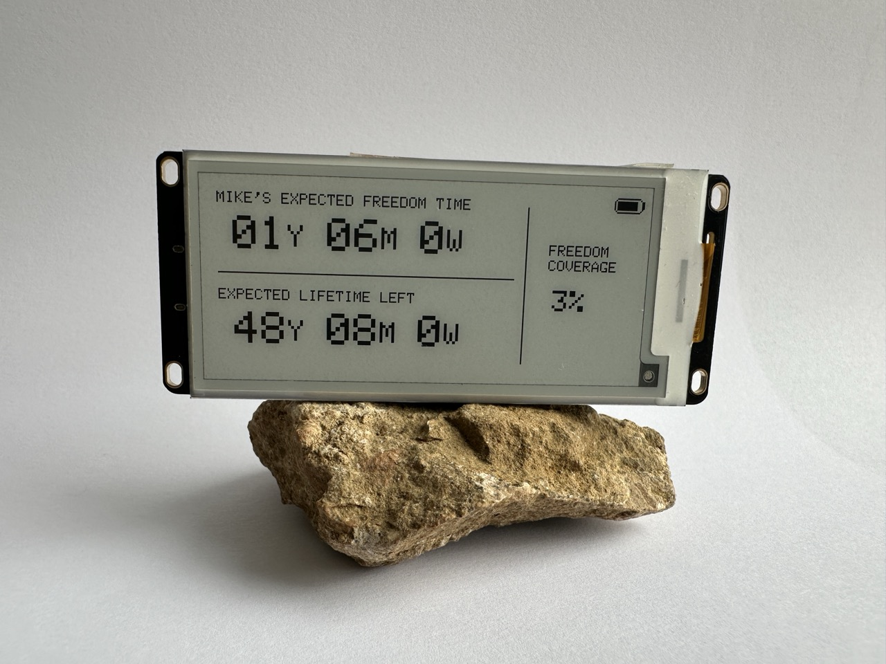
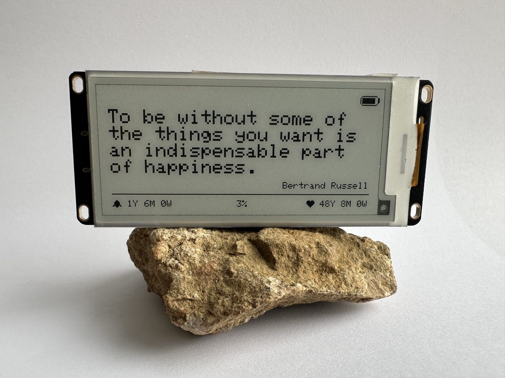
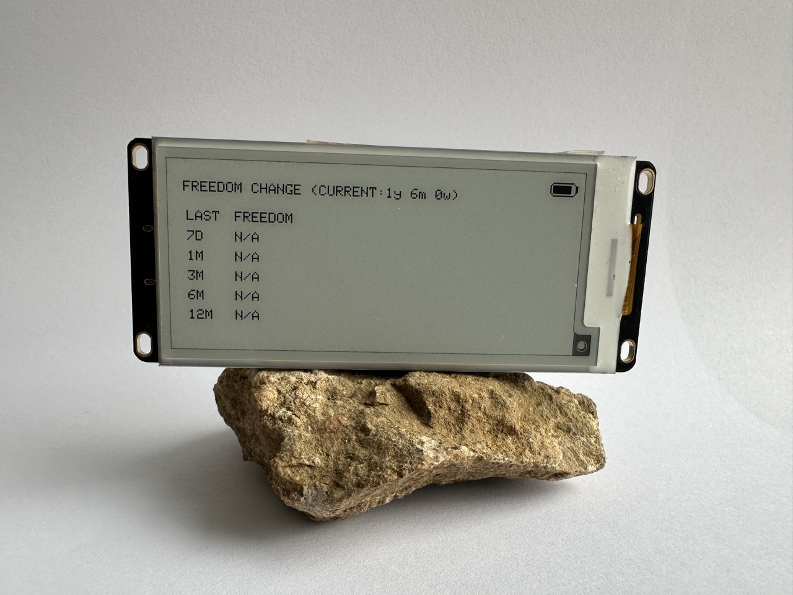
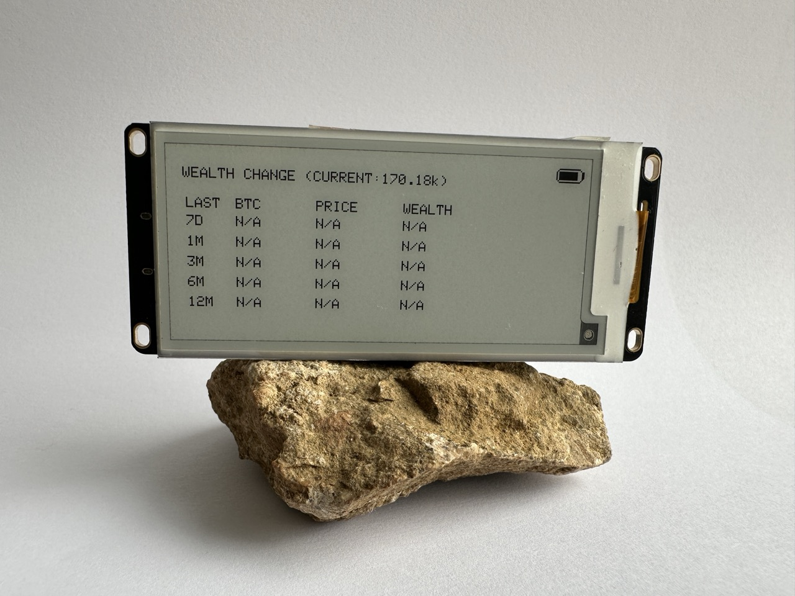
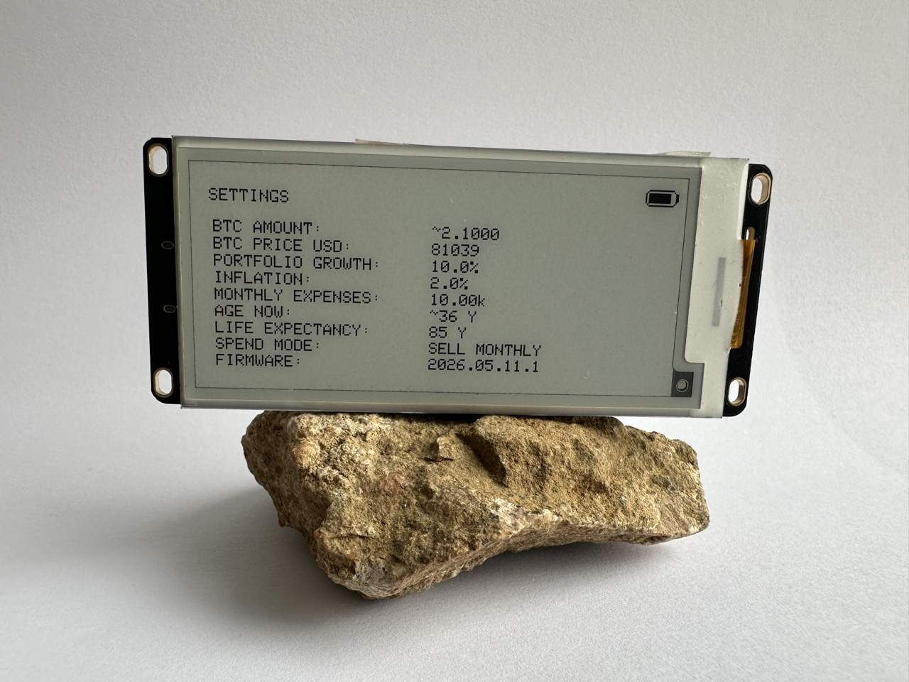
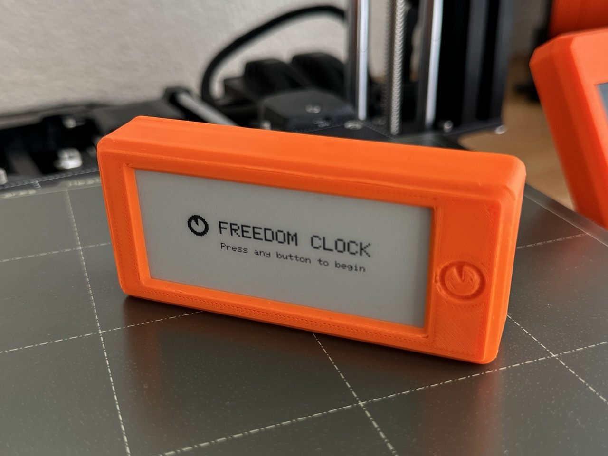
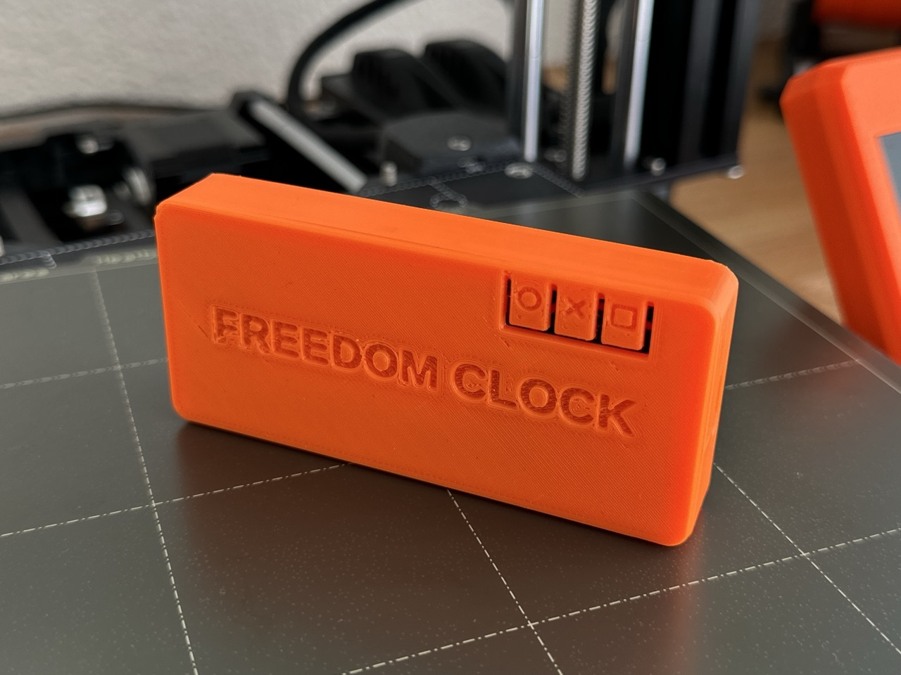
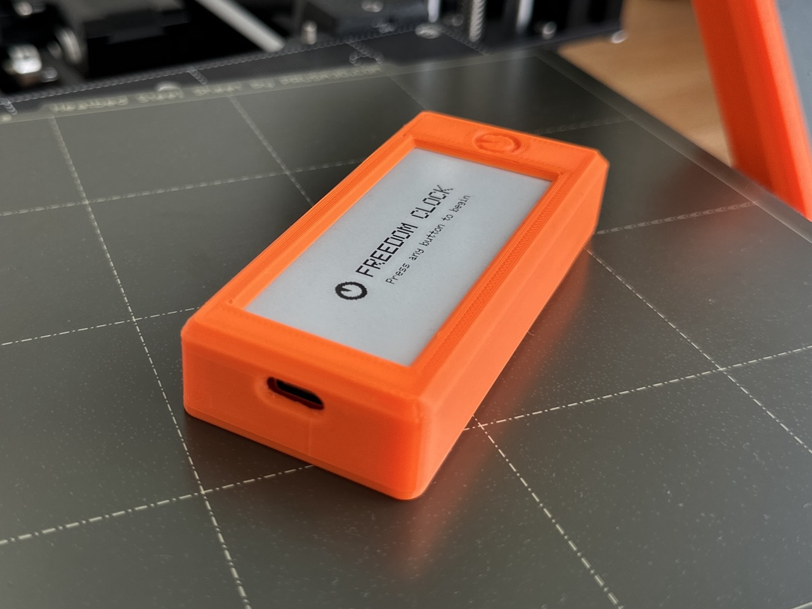
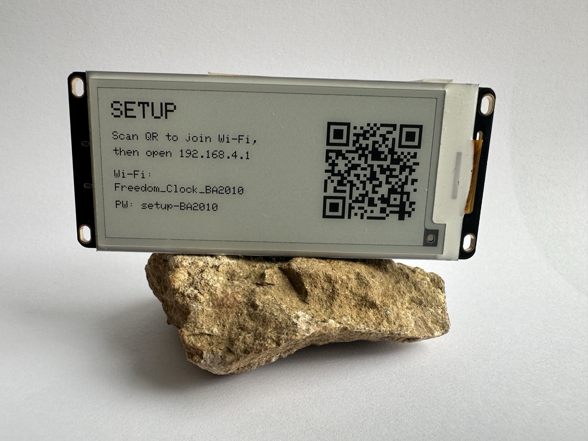
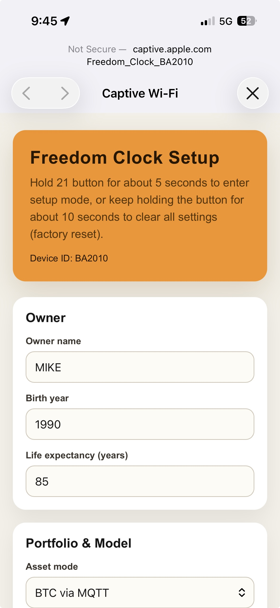

# Freedom Clock

Freedom Clock is a low-power e-ink device that turns savings into time. It is built for anyone who wants a calm, local-first view of freedom coverage instead of another price-anxiety dashboard.



Try the Freedom Clock calculator at [freedomclock.io](https://freedomclock.io/).

The current firmware supports both Heltec Vision Master E-series boards:

- Heltec Vision Master E290 (recommended)
- Heltec Vision Master E213

Both boards use the same source code and release line. The firmware selects the right display driver and layout at compile time based on the board selected in Arduino IDE.

## What It Shows

- Main screen: expected freedom time, expected lifetime left, and freedom coverage. If BTC price or balance is unavailable, the device shows `N/A` where calculated values would be misleading and marks stale data with a small warning icon.

- Optional quote screen: a motivational quote with compact freedom, coverage, and life-left stats at the bottom.



- Freedom change screen: opened with the `FUNCTION` button (`21 / GPIO21`).



- Wealth change screen: current wealth and wealth change. This screen can be hidden from the setup page.



- Settings screen: saved input parameters and firmware information. This screen can be hidden from the setup page.



`FUNCTION` button presses cycle through the enabled wake screens. If the wealth or settings screen is disabled for privacy, it is skipped instead of leaving an empty button slot.

## Portfolio Modes

- Static BTC + price online: enter a BTC amount manually; the device fetches BTC price from CoinGecko in the selected currency, with mempool.space as the backup provider.
- Automatic BTC via MQTT: BTC amount and BTC price come from local MQTT topics. The MQTT price value should use the selected currency.
- Static net worth: enter total wealth directly in the selected currency.

Supported portfolio currencies are `USD`, `EUR`, and `CHF`. `USD` is the default. Monthly expenses, optional monthly income, static wealth, BTC price, cached BTC price, and history values all follow the selected currency.

Spend mode can be either monthly selling or yearly borrowing. Monthly income and income growth default to `0`, so they do not affect the model unless configured. When income is set, the freedom-time model uses the net shortfall between expenses and income, with expenses growing by inflation and income growing by the configured income growth rate. The display can use light mode or dark mode.

MQTT mode is best for bitcoiners who already run local infrastructure, for example a Bitcoin node, home server, or dashboard that watches read-only wallets and publishes values on the local network. In that setup, Freedom Clock only needs the MQTT broker address and topic names for BTC price and BTC amount. It does not need wallet keys, xpubs, exchange logins, or cloud accounts.

When Wi-Fi, CoinGecko, mempool.space, or MQTT is unavailable, the firmware can reuse the last-good BTC price and balance stored locally with a timestamp. The main screen avoids showing false `0y 0m 0w` style values when the current data cannot be trusted.

## Supported Hardware

- Heltec Vision Master E290, 2.90" display, `296 x 128` (recommended) (https://heltec.org/project/vision-master-e290/)
- OR Heltec Vision Master E213, 2.13" display, `250 x 122` (https://heltec.org/project/vision-master-e213/)
- optional, but recommended, 3.7V LiPo battery, 803040 with PH 1.25 Connection (e.g. https://www.amazon.de/-/en/dp/B0DPZLNQ2C?ref=ppx_yo2ov_dt_b_fed_asin_title&th=1)
- optional night reading / front-light notes live in [docs/FRONTLIGHT.md](docs/FRONTLIGHT.md), not tested yet

## 3D Printable Case

The repository includes an E290 case design in [hardware/case](hardware/case):

- `body.stl`
- `cover.stl`
- `freedom_clock_e290_case.scad`

The `.stl` files are ready for slicing/printing. The `.scad` file is the source model and can be modified with [OpenSCAD](https://openscad.org/), a free parametric CAD tool, ideal when you want to adjust the case by using some AI.







## First Setup

On first boot, or after factory reset, the device creates a setup Wi-Fi network:



The setup Wi-Fi name and password are stable per device and are shown on the e-ink screen. The name uses a short 6-character ID derived from the full hardware MAC to avoid raw-MAC collisions while staying easy to type.

The setup page lets you configure owner, life expectancy, portfolio model, Wi-Fi, MQTT, display theme, refresh interval, daily refresh time and time zone, privacy toggles, optional setup PIN, and firmware updates.



Button names used by the firmware:

- `HOME`: the physical `RST` button; restarts the device and refreshes back to the main or quote screen. Represented by 'o' icon at the back of the case.
- `FUNCTION`: the physical `21 / GPIO21` button; wakes the device and cycles through Freedom Change, Wealth Change, and Settings. Represented by 'x' icon at the back of the case.
- `SETUP`: the physical `BOOT / GPIO0` button; press once to enter setup mode, or hold for about 10 seconds to factory reset. Represented by 'square' icon at the back of the case.

Avoid holding `SETUP` while pressing `HOME`; on ESP32 boards that combination can enter the bootloader used for flashing firmware.

## Defaults

Main fallback defaults are in [config.h](src/config.h).

- static BTC amount: `0.1 BTC`
- currency: `USD`
- static net worth: `1000000` in the selected currency
- monthly spend: `10000` in the selected currency
- borrow fee: `8%`
- inflation: `2%`
- portfolio growth: `10%`
- owner: `OWNER`
- birth year: `1990`
- life expectancy: `85`
- refresh: `1 day`
- daily refresh: `07:00`, Zurich / Central Europe
- theme: `Light`

## Privacy

Freedom Clock is local-first. Saved Wi-Fi, MQTT, owner, age model, BTC amount, and PIN data stay on the device. `secrets.h` is optional, gitignored, and should never be committed.

Important OPSEC note: if someone physically steals an unlocked/open device, the screen and flash storage may reveal private assumptions such as owner name, birth year, saved Wi-Fi/MQTT configuration, and portfolio values. For stronger at-rest protection, use the secure device setup guide.

The setup page includes privacy toggles to hide the wealth change screen and settings screen from normal button navigation. These toggles are useful when the device may be visible to other people, but they are not a substitute for encrypted storage on a physically secure device.

For maximum market-data privacy, use MQTT mode and publish BTC price and amount from your own local infrastructure, where you can route requests through Tor, VPN, or your preferred privacy stack. In Static BTC + price online mode, the device pulls BTC price from the internet, so the price provider can see the network IP address. If you use that mode and want stronger network privacy, connect Freedom Clock to a router or Wi-Fi network that already routes traffic through a VPN.

Secure setup guide:

- [docs/SECURE_DEVICE_SETUP.md](docs/SECURE_DEVICE_SETUP.md)

## Battery

Battery percentage is an estimate based on measured LiPo voltage. The firmware uses the board battery ADC and a voltage-to-percent curve, but small differences between batteries, charging circuits, ADC calibration, and load can affect the displayed percentage.

The device can keep a small rolling battery calibration log locally. In developer builds, open setup mode and use `Developer` -> `Battery stats` to copy recent voltage and percentage samples. That data can be used to tune the percentage curve for the real board and battery.

Developer stats are disabled by default. Developers can enable all local diagnostics in `secrets.h`:

```cpp
#define ENABLE_DEVELOPER_STATS 1
```

Even when the Developer section is disabled, minimal boot/setup diagnostics are still printed to Serial so setup failures can be debugged.

## Firmware Updates

The setup page supports two update paths:

- online check and install from the latest GitHub Release when the device has working Wi-Fi with internet access
- manual `.bin` upload from a phone or laptop

Automatic updates can also be enabled from the setup page. When enabled, the device checks GitHub on boot and installs a newer matching release automatically.

Online release checks and downloads use HTTPS certificate validation. If the device cannot sync time with NTP, online updates fail closed instead of downloading firmware over an unverifiable TLS session.

GitHub releases live under:

```text
https://github.com/mr21free/freedom-clock/releases
```

Release assets should be model-specific, for example:

```text
FreedomClock-<version>-E213-manual-update-open.bin
FreedomClock-<version>-E290-manual-update-open.bin
```

Saved settings and daily history stay on the device during a normal firmware update. Factory reset clears saved settings and history.

Before publishing a GitHub Release, run the public release check script:

```sh
./tools/check_release.sh
```

The private release checklist lives in gitignored `dev-local/RELEASING.md`.

## Build And Flash

1. Install Arduino IDE (https://support.arduino.cc/hc/en-us/articles/360019833020-Download-and-install-Arduino-IDE).
2. Install board support in LIBRARY MANAGER of Arduino
   - heltec-eink-modules by Todd Herbert
   - Heltec ESP32 Dev-Boards
   - PubSubClient by Nick O'Leary
   - ArduinoJson by Benoit Blanchon
   - Adafruit GFX Library by Adafruit
3. Open [Freedom_Clock_HeltecVME.ino](Freedom_Clock_HeltecVME.ino).
4. Connect your board via USB to your computer. Select the right device in Tools > Port (usually /dev/cu.usbmodem1101)
5. Select your board in Tools > Board
   - `Heltec Vision Master E213` for E213
   - `Heltec Vision Master E290` for E290
6. Upload the code.
7. Press RST button on the device to wake it up once the code starts uploading 
8. Join the device setup Wi-Fi and configure it in the browser

Important: each board needs firmware compiled for that exact board profile. Do not flash an E213 `.bin` onto an E290 or the other way around.

Optional private bootstrap defaults can be put in a local `secrets.h`:

```cpp
#define USE_SECRETS_BOOTSTRAP 1
#define FREEDOM_WIFI_SSID "your-wifi-name"
#define FREEDOM_WIFI_PASS "your-wifi-password"
```

Use [secrets.example.h](secrets.example.h) as the template.

## Code Structure

The Arduino entrypoint is intentionally small. Most firmware behavior lives in focused headers:

- [config.h](src/config.h): board profile, defaults, constants, and enums
- [config_runtime.h](src/config_runtime.h): saved settings, battery readings, and runtime config helpers
- [setup_portal.h](src/setup_portal.h): captive setup page, validation, Wi-Fi scanning, PIN unlock, and firmware install handlers
- [display_screens.h](src/display_screens.h): e-ink screens, icons, text rendering, and button-visible views
- [btc_data.h](src/btc_data.h): Wi-Fi, MQTT, CoinGecko/mempool.space BTC price fetching, and cached last-good BTC data
- [history.h](src/history.h): wealth/BTC history used by freedom and wealth change screens
- [ota.h](src/ota.h): GitHub release lookup and release asset selection
- [sleep_scheduler.h](src/sleep_scheduler.h): button wake behavior and daily refresh scheduling
- [timezone_support.h](src/timezone_support.h): hardcoded POSIX timezone options for daily refresh
- [security.h](src/security.h): setup PIN hashing and secure-device helper checks

## Developer Test History

To generate fake daily history for reviewing freedom and wealth change screens, temporarily add this to local `secrets.h`, flash once, then remove it again:

```cpp
#define ENABLE_TEST_HISTORY 1
#define FORCE_TEST_HISTORY_ON_EVERY_BOOT 1
```

`ENABLE_TEST_HISTORY` enables synthetic history seeding. `FORCE_TEST_HISTORY_ON_EVERY_BOOT` overwrites that history on every boot, so leave it on only while actively testing.

To show all local developer diagnostics on the setup page in a local developer build:

```cpp
#define ENABLE_DEVELOPER_STATS 1
```

This enables the final `Developer` section on the setup page with copyable Battery stats, Storage stats, and History stats. History stats can include sensitive wealth/BTC history and should be treated as private debug data.

## Device Support

The project uses one shared firmware and one release line. Display differences between E213 and E290 are handled by compile-time device profiles and layout constants, not separate forks.

Details:

- [docs/DEVICE_SUPPORT.md](docs/DEVICE_SUPPORT.md)

## License

MIT
